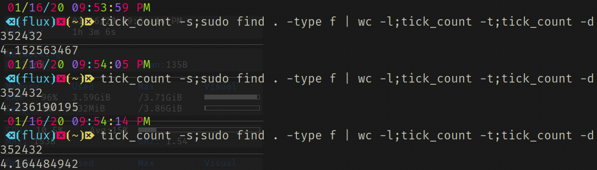

# Tick Count Bash

  
<!-- <style>
:root {
    --white: #EFEFEF;
    --black: #1F1F1F;
    --blue: #2D89EF;
    --maroon: #7E3878;
    --purple: #603CBA;
}
.git-button {
    display: inline;
}
.git-button .p {
    background-color: var(--purple);
}
.git-button .m {
    background-color: var(--maroon);
}
.git-button .b {
    background-color: var(--blue);
}
.git-button .left {
    line-height: 20px;
    padding: 0 8px;
    float: left;
    margin: 0 0 0 8px;
    border-top-left-radius: 5px;
    border-bottom-left-radius: 5px;
    border-left: 1px solid black;
    border-top: 1px solid black;
    border-bottom: 1px solid black;
    background-color: var(--black);
    color: #EFEFEF;
}
.git-button .right {
    line-height: 20px;
    padding: 0 8px;
    float: left;
    margin: 0 8px 0 0;
    border-top-right-radius: 5px;
    border-bottom-right-radius: 5px;
    border-right: 1px solid black;
    border-top: 1px solid black;
    border-bottom: 1px solid black;
    color: #EFEFEF;
}
</style>

<div class="git-button">
    <div class="left">Bash</div>
    <div class="right p">Functions</div>
</div>

<div class="git-button">
    <div class="left">Bash</div>
    <div class="right m">WorkFlow</div>
</div>

<div class="git-button">
    <div class="left">Linux</div>
    <div class="right b">Shell</div>
</div>

<br><br> -->

A Bash function to time/benchmark other shell commands/functions/scripts.

## Installation

As with any other *Bash* function you can either copy the function to your dotfiles or script or source the provided function file itself.

There is a 'tick_count.bash_completion' file to source for bash completion.

## Usage

### Help message

```Bash
 $ tick_count --help
 
 Usage: tick_count [OPTION]...
 Start or stop a timer or get the current tick count.
 Creates global variables $start_tick and $stop_tick.
 This is dependent on 'bc'.

 Options:
        -r, --reset     Reset global variables
        -s, --start     Set $start_tick to current tick
        -t, --stop      Set $stop_tick to current tick
        -d, --diff      Get difference between $stop_tick
                        and $start_tick
        -h, --help      This help message & return

 Example: Benchmark counting files recursively
        -       tick_count -s   # start count
                sudo find . -type f | wc -l  # run command
                tick_count -t   # stop count
                tick_count -d   # echo difference

 Example: Get current tick count
        - tick_count

 Error Levels:
        1               'bc' was not found
        2               Incorrect parameters passed
        3               Both variables are not set

```

### Example



## Files

[Tick_Count](./tick_count)

[Bash Completion](./tick_count.bash_completion)

## Code

```Bash
complete -W "-- - -r -s -t -d -h --reset --start --stop --diff --help" tick_count
function tick_count(){
    which bc > /dev/null 2>&1 || return 1
	local tick=$(date +%s.%N)
	if [[ $# -gt 0 ]]; then
		case "${@^^}" in
			-R|--RESET)	unset start_tick stop_tick
                                        return 0;;
			-S|--START)     unset start_tick stop_tick
                                        start_tick="${tick}"
                                        return 0;;
			-T|--STOP)      stop_tick="${tick}"
                                        return 0;;
                        -D|--DIFF)      [[ -n "${start_tick}" &&
                                        -n "${stop_tick}" ]] &&
                                        bc <<< "${stop_tick} - \
                                                ${start_tick}" ||
                                        return 3
                                        return 0;;
                        -H|--HELP)      cat << EOF
 
 Usage: tick_count [OPTION]...
 Start or stop a timer or get the current tick count.
 Creates global variables \$start_tick and \$stop_tick.
 This is dependent on 'bc'.

 Options:
        -r, --reset     Reset global variables
        -s, --start     Set \$start_tick to current tick
        -t, --stop      Set \$stop_tick to current tick
        -d, --diff      Get difference between \$stop_tick
                        and \$start_tick      
        -h, --help      This help message & return

 Example: Benchmark counting files recursively
        -       tick_count -s   # start count
                sudo find . -type f | wc -l  # run command
                tick_count -t   # stop count
                tick_count -d   # echo difference

 Example: Get current tick count
        - tick_count

 Error Levels:
        1               'bc' was not found
        2               Incorrect parameters passed
        3               Both variables are not set

EOF
                                        return 0;; 
		esac
		return 2
	fi
	echo "${tick}"
}
```

## License

>This program is free software: you can redistribute it and/or modify
it under the terms of the GNU General Public License as published by
the Free Software Foundation, either version 3 of the License, or
(at your option) any later version.

License provided in the [LICENSE](./LICENSE) file
